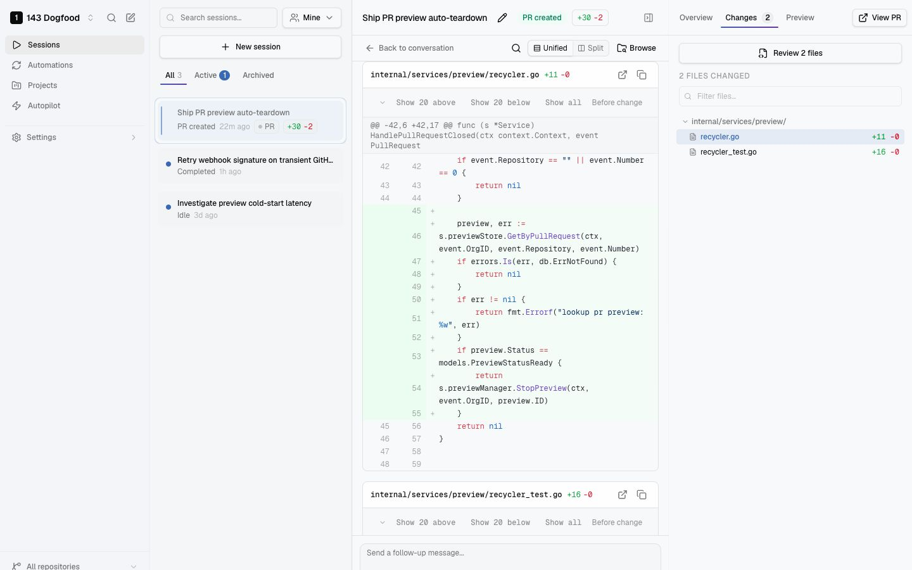

# 143

Open-source coding agent infrastructure for teams.

143 is an open-source platform where your whole team builds software together, running coding agents in the cloud and hooking up to your team's context. You can connect your repos, pick the agents you want (e.g. Codex, Claude Code, OpenCode), integrate with the tools that hold your product context, and let the team kick off work from a browser, Slack, or Linear. You'll get a reviewable branch or GitHub PR, with the diff, transcript, checks, and a live preview all in one place.

[143.dev](https://www.143.dev) · [Docs](https://www.143.dev/docs) · [Architecture](docs/design/overall.md) · [Self-hosting](https://www.143.dev/docs/self-hosting)

<p align="center">
  
</p>

## What is this?

Coding agents can fix real product issues now — often faster when the person closest to the customer spots the problem. But most agent tooling still assumes one engineer at a time, each with their own terminal, credentials, and automations nobody else can see.

143 runs that work as shared team infrastructure: one workspace for sessions, automations, Autopilot runs, prompts, and history. Engineers can keep full control while builders on support, product, and other teams get scoped workflows with review safeguards. The agent stays close to the tools you already trust: GitHub, PR review, CI, and merge rules.

## What it does

- **Team-owned agent work:** automations, sessions, Autopilot runs, and history live in one shared workspace.
- **Context from your existing tools:** GitHub, Linear, Sentry, Slack, Notion, PagerDuty, and more can feed agents the context they need to do the work.
- **Cloud execution:** agents run in isolated sandboxes (Docker/gVisor), so anyone can start work from a browser, Slack, or their phone without keeping a laptop awake.
- **PRs and previews:** output becomes a branch or PR, with a live preview when the repo supports it.
- **Bring the agent you prefer:** 143 is built around coding-agent adapters (Codex, Claude Code, OpenCode, Amp, Pi), so it isn't tied to one model vendor.
- **Review loops before humans step in:** agents can repair failing tests, respond to review feedback, and iterate inside guardrails first.

A common first setup is the smallest one: connect GitHub, choose an agent, connect Linear or Sentry, and run a single issue-to-PR flow. Add automations, previews, and Autopilot when you need them.

## How it works

The fastest way to get started and try it out is our managed service on [143.dev](https://www.143.dev). Sign up, connect GitHub and your tools, and you're running without provisioning workers, sandboxes, or infrastructure yourself. Self-hosting follows the same flow; see [Self-hosting](#self-hosting) below.

1. Connect GitHub repos and the tools that carry product or production context.
2. Start a session manually, schedule an automation, or let Autopilot pick up an eligible issue.
3. 143 spins up an isolated sandbox, checks out the repo, and runs your chosen agent.
4. The agent produces a diff, runs any repo-defined checks, and can launch a preview.
5. 143 opens a branch or PR for normal human review and CI.

The backend is Go and Postgres with a Postgres-backed job queue; the frontend is Next.js; workers run agent sandboxes with Docker/gVisor. The full system design lives in [docs/design/overall.md](docs/design/overall.md).

## Self-hosting

143 is free to run yourself. You bring your own infrastructure, GitHub App, domain, worker capacity, and LLM/coding-agent credentials. This repo contains everything you need: the application code, Dockerfiles, migrations, local dev setup, the single-node deployment path, public docs, and operational scripts.

To run locally, you'll need Go 1.24+, Node.js 24+, and PostgreSQL 17:

```bash
git clone https://github.com/assembledhq/143.git
cd 143
./setup.sh
make dev
```

`setup.sh` installs missing dependencies (Homebrew on macOS, apt/NodeSource on Linux), creates the local database, copies `.env.example` to `.env`, and runs migrations. `make dev` brings up Postgres, the Go API, and the Next.js frontend through Docker Compose.

For production deployment, start with the [self-hosting docs](https://www.143.dev/docs/self-hosting). See [Environment variables](https://www.143.dev/docs/reference/environment-variables) for deployment configuration.

The hosted service at [143.dev](https://www.143.dev) is the managed path.

## Contributing

Issues and PRs are welcome. Start with the [development setup guide](docs/contributing/development-setup.md) and the [design overview](docs/design/overall.md) — a lot of the product decisions are architectural, and the design docs are in the repo on purpose. See [CONTRIBUTING.md](CONTRIBUTING.md) for the rules, and report security issues through [SECURITY.md](SECURITY.md) rather than public issues.

## Why "143"?

In 1943, Lockheed's Skunk Works built the XP-80 Shooting Star — America's first operational jet fighter — in 143 days. The name is a nod to small teams with enough ownership to move fast.

Built by the team at [Assembled](https://www.assembled.com) and open-sourced from our own internal use.

## License

[MIT](LICENSE)
