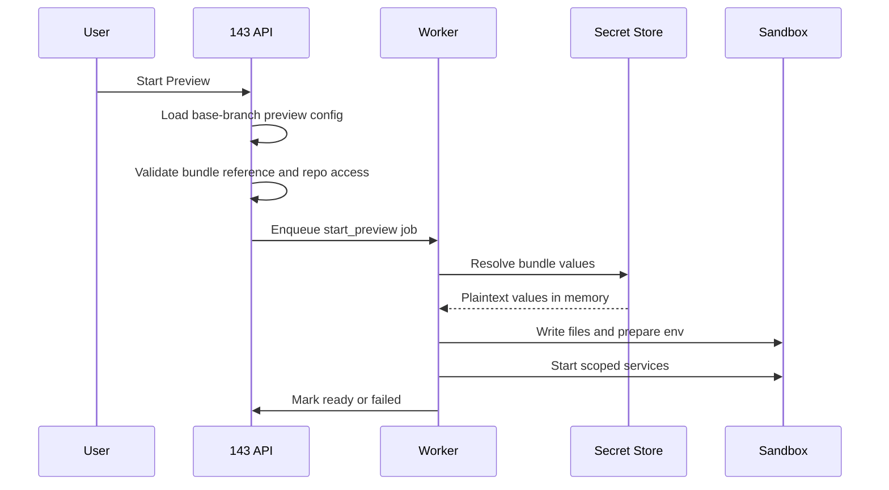

# Design: Preview Secret Bundles

> **Status:** V1 implemented; V2 future | **Last reviewed:** 2026-05-26
>
> V1 managed bundle support is implemented: repo config parsing, insert-only repo-scoped bundle storage, encrypted managed values, env/file rendering, preview runtime injection, id-based admin API endpoints including test resolution, repository settings UI, audit events for admin changes and runtime resolution, and runtime log redaction for generated secret files. V2 external secret sources remain future work.

Preview secret bundles let a repo run a realistic preview without committing development credentials to GitHub. The repo declares **what it needs**. An org admin configures **where those values come from** and **how they are delivered**. 143 resolves the bundle at preview start and injects the result into only the services that need it.

This is an extension of the existing preview credential model in `.143/config.json`, not a separate runtime system. New repo config should use product language (`secrets`) while the implementation can keep accepting the older `credentials` shape as a compatibility alias.

## Motivation

Many apps do not boot from code alone. They need a database URL, auth signing key, queue mode, third-party API key, or framework-specific config file. In the Assembled preview case, the backend tried to start without `development.conf.json` or equivalent env overrides, so startup failed at:

```text
Invalid queue type:
```

The immediate fix for that repo is small: provide values like `MSGBROKER_QUEUE_TYPE=local` and whatever database/Snowflake settings the webserver requires. The product problem is broader: every repo keeps secrets in a different shape.

Some repos use env vars. Some use `.env`. Some use JSON, YAML, TOML, or framework-specific config files. Some already store a whole dev config object in AWS Secrets Manager. A good preview system should support those differences without making every user learn a complex secrets platform.

## Goals

1. Keep repo setup simple: one named bundle reference in `.143/config.json`.
2. Keep secret values out of GitHub, agent diffs, logs, and browser-visible config.
3. Support common delivery shapes: env vars and files.
4. Let admins back a bundle with either 143-managed values or an external source such as AWS Secrets Manager.
5. Scope each bundle to specific repositories and preview services.
6. Preserve the preview trust split: when secrets are involved, untrusted branch diffs cannot broaden what gets secret access.

## Non-Goals

1. General-purpose production secret management.
2. Passing arbitrary cloud credentials into the sandbox so app code can fetch secrets itself.
3. Secret access for every agent terminal command by default.
4. Supporting every config file format in v1.
5. Letting a PR change which secrets it receives.

## Product Shape

The user-facing concept is a **secret bundle**.

A bundle has:

| Field | Meaning |
|---|---|
| Name | Stable handle such as `assembled-dev` or `staging-preview`. |
| Repository | The existing 143 repository row this bundle belongs to. |
| Source | Where values come from: 143-managed values in v1, external secret stores later. |
| Outputs | How resolved values appear inside the preview: env vars or files. |
| Service scope | Which preview services receive the bundle. |
| Exposure policy | Whether values are acceptable for the preview sandbox or require stronger agent-hidden isolation. |
| Status | Ready, missing values, source unreachable, disabled. |

The bundle is configured in 143 by an admin. The repo only commits the bundle reference and the non-secret output contract.

```json
{
  "preview": {
    "name": "Assembled",
    "primary": "frontend",
    "services": {
      "frontend": {
        "command": ["bash", ".143/preview-frontend.sh"],
        "port": 8080,
        "env": {
          "WEBSERVER": "localhost",
          "WEBSERVER_PORT": "3000"
        },
        "ready": { "http_path": "/" }
      },
      "webserver": {
        "command": ["bash", ".143/preview-webserver.sh"],
        "port": 3000,
        "env": {
          "PORT": "3000",
          "LOG_LEVEL": "INFO"
        },
        "ready": { "http_path": "/api/sessions" }
      }
    },
    "secrets": [
      {
        "bundle": "assembled-dev-env",
        "services": ["webserver"],
        "env": ["MSGBROKER_QUEUE_TYPE"]
      },
      {
        "bundle": "assembled-dev-config",
        "services": ["frontend", "webserver"],
        "files": ["development.conf.json"]
      }
    ],
    "network": {
      "mode": "managed",
      "destinations": ["assembled-dev-db"]
    }
  }
}
```

For the person starting a preview, that should read as: "this repo needs preview secret bundles; env values are delivered to the listed services, while generated files are workspace-wide and must list every preview service."

### Repo Config Naming

Use the simplest repo-facing shape:

```json
{
  "preview": {
    "secrets": {
      "bundle": "assembled-dev",
      "services": ["frontend", "webserver"],
      "files": ["development.conf.json"]
    }
  }
}
```

Only `bundle` and `services` are required. `env` and `files` are optional non-secret hints that let 143 show a useful setup checklist before the bundle exists.
When `files` is present, `services` must include every preview service because generated files are written into the shared workspace. If an env var should go only to a backend service, use a separate env-only bundle.

Recommended field names:

| Field | Recommendation | Why |
|---|---|---|
| `secrets` | Use this in new repo config. | It matches how GitHub, Codex, Cursor, Devin, and most developers talk about hidden runtime values. |
| `bundle` | Use one named bundle handle. | Short, stable, and easy to understand in code review. |
| `services` | Use instead of `inject_into`. | It describes the outcome without implementation language. |
| `env` | Optional list of secret env var names the repo expects. | Lets 143 prefill setup and explain missing values without putting values in Git. |
| `files` | Optional list of generated secret config files the repo expects. | Makes file-based apps discoverable without committing the file contents. |
| `mode` | Avoid in new config. | A required enum like `managed_bundle` adds ceremony without helping the repo author. |
| `credentials` | Keep as a backward-compatible alias. | Existing preview config already uses it, but it reads more like login credentials than app config secrets. |
| `credential_set` | Deprecate in favor of `bundle`. | `bundle` covers env vars, files, and external sources. |

If multiple bundles are needed later, support an array while preserving the one-bundle shorthand:

```json
{
  "preview": {
    "secrets": [
      { "bundle": "assembled-dev", "services": ["webserver"] },
      { "bundle": "stripe-sandbox", "services": ["webserver"] }
    ]
  }
}
```

Do not require `secrets: { "mode": "none" }` for repos that do not need secrets. Omission should mean none.

## Setup Ownership

Secret bundle setup is split between the repo and 143.dev:

| Location | Owns | Must not contain |
|---|---|---|
| `.143/config.json` | Bundle name, service scope, and optional non-secret setup hints such as env var names and file paths. | Secret values, AWS credentials, database URLs, API keys, or config file contents. |
| 143.dev admin UI | The actual bundle: source, values, output definitions, repository binding, exposure policy, and test status. | Repo-authored code changes. |
| Preview runtime | Resolved env vars and generated files for the scoped services. | Durable plaintext in logs, job payloads, API responses, or preview lifecycle records. |

The bundle does not need to exist before a repo commits `.143/config.json`. In fact, the best flow is usually:

1. A repo author adds the preview config with `preview.secrets.bundle`.
2. 143 detects the referenced bundle on the base branch.
3. If the bundle does not exist or is incomplete, 143 shows `Setup required` instead of starting the app and letting it crash.
4. An org admin creates or connects the bundle in 143.dev using the detected name, services, env names, and file paths as prefilled setup context.
5. 143 tests bundle resolution without launching the app.
6. Preview startup uses the resolved bundle.

This makes setup discoverable from the repo while keeping secret material in the product.

## Autodetection

143 should inspect `.143/config.json` whenever it imports a repo, refreshes repo settings, renders preview readiness, or starts a preview. Detection reads from the trusted base branch for connected previews.

Detection should produce a small requirement record:

```json
{
  "bundle": "assembled-dev",
  "services": ["frontend", "webserver"],
  "files": ["development.conf.json"],
  "status": "setup_required"
}
```

Possible statuses:

| Status | Meaning |
|---|---|
| `not_required` | The preview config has no `secrets` block. |
| `setup_required` | The repo references a bundle that does not exist for this org/repo. |
| `incomplete` | The bundle exists but is missing required env vars, required files, source configuration, or the expected repository binding. |
| `ready` | The bundle exists, is allowed for the repo, and passes resolution tests. |
| `unavailable` | The bundle exists but the external source cannot be reached or decrypted. |

Product surfaces should use that detection result consistently:

- Repo settings: show a Preview secrets card for every detected bundle.
- Preview tab: block launch with a setup-required message before app startup.
- Admin setup flow: offer `Create bundle from detected config`.
- Non-admin flow: offer `Request setup` with the repo, bundle, services, env names, and file paths prefilled.
- Branch/PR previews: evaluate secret requirements from the base branch so a PR cannot introduce a new secret requirement and receive values automatically.

## Source and Output Model

The important split is **source vs output**.

Source answers: where does 143 get the values?

Output answers: how does the app receive them?

Most competitors stop at "encrypted secret store -> env vars." That is useful, but too narrow for previewing real repos. 143 should keep env vars as the easy path and add first-class file delivery for repos that already have config file conventions.

### Output Type: Env

Env delivery is the default and should remain the easiest path.

Admin bundle setup:

```json
{
  "outputs": [
    {
      "type": "env",
      "values": {
        "DATABASE_URL": "secret:database_url",
        "MSGBROKER_QUEUE_TYPE": "literal:local"
      }
    }
  ]
}
```

At preview start, the selected service process receives:

```text
DATABASE_URL=postgres://...
MSGBROKER_QUEUE_TYPE=local
```

Repo-authored `preview.services.<service>.env` remains for non-secret values only.

### Output Type: File

File delivery writes a generated file before services start. This handles repos that expect `.env`, `development.conf.json`, `config/local.yml`, or similar files.

Admin bundle setup:

```json
{
  "outputs": [
    {
      "type": "file",
      "path": "development.conf.json",
      "format": "json",
      "mode": "0600",
      "content": {
        "msgbroker": {
          "queue_type": "local"
        },
        "database": {
          "application": "secret:application_database_url",
          "readonly": "secret:readonly_database_url"
        }
      }
    }
  ]
}
```

143 writes the file inside the repo workspace before `preview.install` or service startup, depending on the bundle's phase. File paths must be relative, stay inside the repo, and should be excluded from artifacts and diff views. Because the current preview runtime uses a shared workspace, file outputs are workspace-wide: the repo config must list every preview service for a bundle that declares `files`.

File delivery is inherently more exposed than product-owned process injection because the app expects a readable file. In the current preview model, app services and follow-up agent commands can share a sandbox filesystem. That means file-delivered values should be treated as **preview-runtime secrets**, not automatically **agent-hidden secrets**, unless the provider runs secret-bearing services in a separate user/container namespace or pauses same-sandbox agent command execution while the preview is connected.

Supported v1 formats should be:

| Format | Use |
|---|---|
| `env` | Render `.env` style `KEY=value` files. |
| `json` | Render structured config such as `development.conf.json`, either from structured `content` with `secret:` references or from one managed secret value containing the whole JSON document. The resolved document must parse as JSON before the bundle is accepted. |
| `raw` | Write one complete secret value as a file, useful for certificates, PEM blocks, or other non-JSON blobs. |

YAML and template rendering can come later. JSON plus env files cover the common cases without making the first version too flexible.

Admins should not need to base64-encode JSON just to survive env or shell quoting. The product stores managed values as strings and the preview runtime writes generated files from bytes; implementation may base64 those bytes internally while crossing a shell boundary, but that is a runtime transport detail, not part of the admin or repo-authored contract. User-provided base64 is still acceptable when the application itself expects base64, but it should not be required for `development.conf.json`.

## Source Model

Start with two source types. Do not add generated-value composition until there is a concrete customer need; platform-managed preview infrastructure already has its own env injection path.

### V1: 143-Managed Values

Admins paste values into 143. 143 stores them encrypted at rest using the existing envelope-encryption pattern. This is the fastest version to ship and maps cleanly to GitHub Copilot, Cursor, Devin, Replit, and v0-style product behavior: users configure secrets in the product, and the runtime receives them.

### V2: External Secret Reference

Admins can point a bundle at an external source:

```json
{
  "source": {
    "type": "aws_secrets_manager",
    "region": "us-east-1",
    "secret_id": "assembled/development-conf"
  }
}
```

143 fetches the secret on the worker side during preview start. The sandbox should not receive AWS credentials just to fetch its own config. If a company already stores `development.conf.json` in AWS Secrets Manager, 143 should pull that value and render it as a file or map selected fields into env vars.

External source credentials are platform credentials, not preview app credentials. They should be scoped by org, hidden from repo config, and audited separately.

## Runtime Flow



Plaintext exists only during resolution, process env preparation, and the lifetime of any generated runtime files. It should never be persisted in `preview_instances.recycle_config`, preview logs, job payloads, or frontend API responses.

## Trust and Safety Rules

1. **Base-branch pinning.** For connected previews, read `secrets` or legacy `credentials`, `network`, service names, output file paths, and service scope from the base branch. A session diff cannot add a new secret bundle, change `services`, or write a secret file to a different path.
2. **Service scoping.** A bundle is delivered only to services listed in `secrets.services`.
3. **Explicit exposure policy.** Values delivered into a preview service are not shown in prompts, frontend APIs, or normal agent env. They may still be reachable to code running in the same sandbox through process inspection, filesystem reads, or app behavior. Mark this product surface honestly as `preview_runtime`. A stricter `agent_hidden` policy requires provider-level isolation before it can be offered.
4. **No agent-owned secret fetch.** The sandbox app should receive final values, not broad cloud credentials.
5. **No browser secrets.** Never inject secret bundle values into frontend build-time public env vars such as `NEXT_PUBLIC_*`, `VITE_*`, or browser-rendered config files unless an admin explicitly marks a value public.
6. **Redaction.** Preview logs redact exact secret values and common derived forms such as URLs with credentials. File contents are not printed.
7. **Audit events.** Creating, updating, disabling, resolving, and failing to resolve bundles emits audit events with bundle name, repo, service names, source type, and output paths. Audit details never include plaintext.
8. **Path constraints.** File delivery paths must be relative, stay inside the repo, avoid `.git`, and reject parent traversal.
9. **Lifecycle cleanup.** Generated files are deleted when the preview stops where possible. The stronger guarantee is sandbox destruction; cleanup is defense-in-depth.

## Exposure Policies

Secret bundles should expose a small, honest choice rather than hiding security behavior in implementation details.

| Policy | Meaning | V1 support |
|---|---|---|
| `preview_runtime` | Values are available to selected preview services. They are not included in prompts, frontend APIs, normal agent env, or logs, but may be reachable inside the same sandbox. | Yes. |
| `setup_only` | Values are available only during dependency/setup work and removed before app/agent runtime. Useful for private package registries. | Later. |
| `agent_hidden` | Values are available to the running app but not to agent commands in the same session. Requires separate preview runtime isolation or command pause semantics. | Later. |
| `public` | Value is intentionally browser-visible, such as a public analytics key. | Later; should be rare and explicit. |

V1 should only promise `preview_runtime`. That is still useful for development database URLs and repo-specific dev config, and it avoids copying sensitive values into GitHub. It should not be marketed as a way to keep secrets from arbitrary code executing in the same sandbox.

## UX

### Repo Author Experience

The repo author should only need to commit:

```json
{
  "preview": {
    "secrets": {
      "bundle": "assembled-dev",
      "services": ["frontend", "webserver"],
      "files": ["development.conf.json"]
    }
  }
}
```

If the bundle is missing, preview startup should fail before running app code with a clear message:

```text
Preview needs the "assembled-dev" secret bundle.
Ask an org admin to create it or choose a preview config that does not require secrets.
```

### Admin Experience

Admins see a guided setup:

1. Confirm the repository.
2. Name the bundle.
3. Choose source: enter values in 143, or connect an external source.
4. Choose outputs: env vars or file.
5. Choose service scope.
6. Test resolution without starting the preview app.

The UI should show names and destinations, not values:

```text
assembled-dev
Repos: assembledhq/assembled
Source: AWS Secrets Manager / assembled/development-conf
Exposure: Preview runtime
Outputs:
  - file development.conf.json -> workspace
  - env MSGBROKER_QUEUE_TYPE -> webserver
Status: Ready
```

### Non-Admin Experience

If a non-admin starts a preview that requires a missing bundle, show a request flow rather than a dead end:

```text
This preview needs admin-managed secrets.
Requested: assembled-dev
Used by: webserver
Outputs: development.conf.json, MSGBROKER_QUEUE_TYPE
```

The user can request setup from admins with one click. The request should include the repo, preview config name, bundle name, and non-secret output contract.

## Data Model Sketch

Use the existing `repositories` table for repo ownership. A secret bundle is repo-scoped, so v1 does not need a separate bundle-to-repository join table. If a team wants the same logical bundle on two repos, they can create two repo-scoped bundles with the same name; cross-repo sharing can be added later if it proves necessary.

Make `preview_secret_bundles` itself insert-only/versioned. Updating a bundle deactivates the current active row for `(org_id, repository_id, name)` and inserts a new row. Disabling a bundle inserts an inactive row. This preserves history without a separate versions table.

```sql
CREATE TABLE preview_secret_bundles (
    id uuid PRIMARY KEY,
    org_id uuid NOT NULL REFERENCES organizations(id),
    repository_id uuid NOT NULL REFERENCES repositories(id),
    name text NOT NULL,
    active boolean NOT NULL DEFAULT true,
    source_type text NOT NULL,
    source_config_encrypted jsonb NOT NULL,
    outputs_config_encrypted jsonb NOT NULL,
    exposure_policy text NOT NULL DEFAULT 'preview_runtime',
    created_by_user_id uuid NOT NULL REFERENCES users(id),
    created_at timestamptz NOT NULL DEFAULT now()
);

CREATE UNIQUE INDEX preview_secret_bundles_active_name_idx
    ON preview_secret_bundles (org_id, repository_id, name)
    WHERE active = true;
```

Readiness status is computed by resolving the active bundle version and checking the source, outputs, repo scope, and required hints from `.143/config.json`. Do not mutate secret configuration rows just to record transient source outages. If status history becomes useful later, add a small health table keyed by the active bundle version. Query paths always filter by `org_id` and `repository_id`.

## Encryption

Secret bundle values and external source credentials should be encrypted at the application layer before they are written to Postgres. Database disk encryption and encrypted backups are useful defense-in-depth, but they are not enough because the database still sees plaintext if the application stores plaintext.

Use envelope encryption:

1. Generate a random per-bundle-version data encryption key (DEK) with a CSPRNG.
2. Encrypt `source_config` and `outputs_config` with an AEAD cipher, preferably AES-256-GCM.
3. Use authenticated data (AAD) that binds ciphertext to its context: `org_id`, `repository_id`, bundle `name`, bundle version `id`, field name, and algorithm version.
4. Wrap the DEK with a key encryption key (KEK) from a managed key service such as AWS KMS, GCP Cloud KMS, Azure Key Vault, HashiCorp Vault, or an HSM-backed equivalent.
5. Store only ciphertext, nonce, encrypted DEK, KEK version, algorithm, and AAD metadata in Postgres.
6. Never store the KEK in Postgres. For self-hosted installs without KMS, the existing `ENCRYPTION_MASTER_KEY` style can act as the KEK, but KMS/HSM should be the recommended production path.

Given 143's current production shape, the practical v1 KEK store should be the existing sops-managed production env path: `.env.production.enc`, decrypted onto app/worker hosts at deploy/boot the same way `ENCRYPTION_MASTER_KEY` is handled today. Prefer a dedicated `PREVIEW_SECRET_BUNDLE_KEK` over reusing `ENCRYPTION_MASTER_KEY` so preview runtime secrets can be rotated independently from integration credentials. Store a non-secret version label next to it, such as `PREVIEW_SECRET_BUNDLE_KEK_VERSION=preview-secrets-2026-05`.

That is not as strong as cloud KMS because any process or host that can read the runtime env can use the KEK. It is still a good fit for v1 because it matches the existing operational model, avoids adding AWS credentials just to decrypt local DB rows, and protects against database-only compromise or leaked backups. The stronger future option is a managed KMS or Vault Transit backend once production already has a cloud identity plane for app/worker hosts. If 143 runs on AWS EC2/ECS with instance/task roles, use AWS KMS CMKs and IAM instead of storing AWS access keys in `.env.production.enc`. If hosts remain VPS-based, adding AWS KMS usually means storing long-lived AWS credentials in the env file, which is not a clear security win over the current sops-protected KEK.

Implementation note: the backend config has `PREVIEW_SECRET_BUNDLE_KEK` and `PREVIEW_SECRET_BUNDLE_KEK_VERSION`. The backend also falls back to the existing `ENCRYPTION_MASTER_KEY` when the preview-specific KEK is unset. Production should add the dedicated preview KEK before relying on preview secret bundles for real customer secrets; until then, preview bundles share the integration-credential KEK.

The v1 implementation stores a compact encrypted blob with `alg`, `kid`, and `ciphertext`; the ciphertext is produced by the existing application crypto service, which uses AES-256-GCM envelope encryption internally. The stronger long-term stored shape should make the envelope metadata explicit and bind ciphertext to bundle context with AAD:

```json
{
  "alg": "AES-256-GCM",
  "kek_version": "preview-secrets-2026-05",
  "nonce": "base64...",
  "ciphertext": "base64...",
  "encrypted_dek": "base64...",
  "aad": {
    "org_id": "...",
    "repository_id": "...",
    "bundle_id": "...",
    "field": "outputs_config"
  }
}
```

Operational rules:

- Generate a unique nonce for every AES-GCM encryption. Never reuse a `(DEK, nonce)` pair.
- Decrypt only in the worker/control-plane path that resolves a bundle for preview startup or admin testing.
- Keep plaintext in memory only long enough to render env vars/files. Do not persist plaintext in preview rows, job payloads, logs, audit entries, cache keys, or frontend responses.
- Redact exact values and common derived forms such as URLs with embedded credentials.
- Audit create, update, disable, test, and runtime resolve events with bundle metadata only.
- Rotate KEKs by writing new versions with the new key and by background re-wrapping encrypted DEKs. Do not require every secret value to be re-entered for KEK rotation.
- Use short-lived in-process caches, if any, for unwrapped DEKs or plaintext. Prefer no plaintext cache for v1.
- Encrypt database backups and restrict production read access because encrypted blobs still carry sensitive metadata.

This follows the same broad pattern recommended by [OWASP Secrets Management](https://cheatsheetseries.owasp.org/cheatsheets/Secrets_Management_Cheat_Sheet.html): use authenticated encryption such as AES-GCM and envelope encryption, and keep encryption keys in a vault/KMS rather than next to the encrypted secrets. [AWS KMS](https://docs.aws.amazon.com/kms/latest/developerguide/kms-cryptography.html) describes the same pattern as encrypting data with a data key and encrypting that data key under another key. [NIST SP 800-57](https://www.nist.gov/publications/recommendation-key-management-part-1-general-0) is the baseline reference for key-management lifecycle practices.

## API Shape

Admin APIs:

| Route | Purpose |
|---|---|
| `GET /api/v1/repositories/{repo_id}/preview-secret-bundles` | List active bundle summaries for a repo. |
| `POST /api/v1/repositories/{repo_id}/preview-secret-bundles` | Create the first active version of a bundle, or replace the active version with the same name. |
| `GET /api/v1/repositories/{repo_id}/preview-secret-bundles/{name}` | Compatibility read by repo and bundle name. |
| `DELETE /api/v1/repositories/{repo_id}/preview-secret-bundles/{name}` | Compatibility disable by repo and bundle name. |
| `GET /api/v1/preview-secret-bundles/{id}` | Show metadata and output names. |
| `PATCH /api/v1/preview-secret-bundles/{id}` | Create a new active version after rename, source, output, or exposure-policy changes. |
| `DELETE /api/v1/preview-secret-bundles/{id}` | Disable by inserting an inactive successor version. |
| `POST /api/v1/preview-secret-bundles/{id}/test` | Resolve the bundle and return only metadata/status. |

Worker-facing service:

```go
type PreviewSecretResolver interface {
    Resolve(ctx context.Context, orgID uuid.UUID, repoID uuid.UUID, cfg *models.PreviewConfig) error
}
```

The resolver returns in-memory env/file payloads to the preview provider. It does not return plaintext through HTTP API responses.

## Compatibility With Existing Preview Credentials

The current guide documents:

```json
{
  "credentials": {
    "mode": "managed_env",
    "credential_set": "repo-staging",
    "env": ["DATABASE_URL", "STRIPE_KEY"],
    "inject_into": ["server"]
  }
}
```

That can remain as a simple shorthand:

```json
{
  "secrets": {
    "bundle": "repo-staging",
    "services": ["server"]
  }
}
```

Existing `managed_env` maps to a bundle with a single env delivery. Existing `credentials.inject_into` maps to `secrets.services`. New file delivery should use the `secrets` spelling in docs and UI examples.

## Competitive Baseline

Other products generally support encrypted secrets, but most expose them primarily as environment variables:

| Product | Current pattern |
|---|---|
| OpenAI Codex cloud environments | Environment variables are available through setup and agent phases; secrets are encrypted and available to setup scripts, then removed before the agent phase. See [Codex cloud environments](https://developers.openai.com/codex/cloud/environments). |
| GitHub Copilot cloud agent | Dedicated Agents secrets and variables can be configured at org or repo level and are exposed as environment variables; secret values are masked in logs. See [GitHub Copilot cloud agent secrets](https://docs.github.com/en/copilot/how-tos/copilot-on-github/customize-copilot/customize-cloud-agent/configure-secrets-and-variables). |
| Cursor Background Agents | Setup lives in `.cursor/environment.json`; secrets entered during setup are stored encrypted at rest and provided in the agent environment. See [Cursor Background Agents](https://docs.cursor.com/background-agents). |
| Devin | Supports global, repo-specific, and session-specific secrets; repo-specific secrets can be added as env vars or in a `.env` file during environment configuration. See [Devin secrets](https://docs.devin.ai/product-guides/secrets). |

143's opportunity is not "we also have encrypted env vars." The better product is:

1. Explicit separation between secret source and output shape.
2. First-class file delivery for real repo conventions.
3. Service-scoped runtime injection for previews, not blanket agent environment access.
4. Base-branch pinning when secrets are involved.
5. Clear setup requests for non-admins.

## Rollout Plan

### V1: 143-Managed Repo Bundles

- Implemented: create the insert-only `preview_secret_bundles` table and backend admin CRUD.
- Implemented: scope each bundle to one existing `repositories` row.
- Implemented: encrypt 143-managed source values and output config at the application layer before writing to Postgres.
- Implemented: support env, `.env`, JSON, and raw file outputs.
- Implemented: resolve outputs into scoped preview services.
- Implemented: wire legacy `managed_env` to the same resolver as compatibility shorthand.
- Implemented: autodetection exposes setup-required bundle hints from `.143/config.json`.
- Implemented: repository settings UI lets admins create, update, list, and delete managed bundles.
- Implemented: audit events cover admin bundle create/update/delete and runtime resolve/failure without plaintext values.
- Implemented: runtime-generated secret file write commands are redacted from sandbox debug logs.

### V2: External Secret Sources

- Add AWS Secrets Manager as the first external source.
- Store external source access config as encrypted platform credentials.
- Resolve external source values worker-side.
- Add source health checks, rotation guidance, and clear `unavailable` diagnostics.

## Open Questions

1. Should `preview.install` receive runtime app bundles, or should bundle delivery default to service startup only? Some apps need private package registry tokens during install; those are closer to setup secrets than runtime app secrets.
2. Should file delivery happen before or after `preview.install`? The safest default is before service startup only, with an explicit `phase` if install needs it.
3. How should bundle changes affect preview startup cache invalidation?
4. Should session-level temporary secrets exist, or should v1 stay org/repo-scoped only?
5. Should connected previews always pin the entire config to base branch, or can non-secret fields remain diff-driven if delivery paths and scopes are pinned?
6. What provider isolation is required before offering `agent_hidden` as a product promise?

## Recommended V1

Ship the smallest useful version:

1. Admin-created `preview_secret_bundles`.
2. 143-managed encrypted values.
3. Env delivery.
4. JSON and `.env` file delivery.
5. Repo binding and service `services`.
6. Base-branch pinning for all connected preview config.
7. Clear missing-bundle startup errors.

That is enough to solve the Assembled preview shape while creating a clean path to AWS Secrets Manager.
