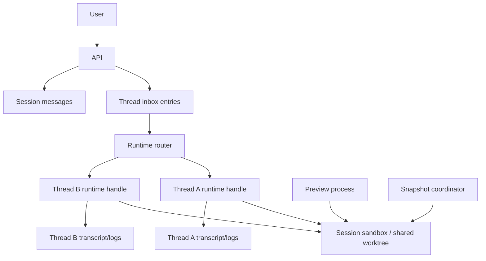

# Design: Shared Sandbox Thread Runtimes

> **Status:** Implemented | **Last reviewed:** 2026-05-27
>
> **Related docs:** [overall.md](../overall.md), [68-sandbox-agent-tabs-and-threads.md](68-sandbox-agent-tabs-and-threads.md), [75-thread-runtime-handles-and-durable-inbox.md](../future/75-thread-runtime-handles-and-durable-inbox.md), [70-live-agent-command-handles.md](../future/70-live-agent-command-handles.md), [82-durable-session-executors.md](82-durable-session-executors.md), [60-agent-runtime-timeouts-and-checkpointed-shutdown.md](../future/60-agent-runtime-timeouts-and-checkpointed-shutdown.md), [44-sandbox-preview-server.md](44-sandbox-preview-server.md)

## Summary

Session tabs should behave like tmux panes inside one shared development
environment.

The product mental model is:

- a **session** owns the sandbox, worktree, branch, preview, PR, and final
  shipping artifact
- a **tab/thread** owns one independent agent conversation and one live runtime
  lane inside that sandbox
- the user can send messages to any tab without waiting for another tab to
  finish
- all tabs see and mutate the same files, just like terminal panes sharing one
  checkout

The engineering model should match that mental model:

- the sandbox is a durable session-owned resource with leased holders
- each thread has a durable inbox, delivery cursors, transcript, status, cancel
  path, cost accounting, and live runtime handle
- input delivery is per-thread and concurrent
- recovery is driven by durable inbox and runtime registry state, not by
  assumptions in one worker loop
- shared filesystem risks are surfaced clearly instead of hidden

The implementation supports the runtime shape for concurrent sibling tabs:
admitted threads enqueue independent `continue_session` jobs, race into the same
shared sandbox, and keep per-thread process/routing state addressable through
runtime leases and sandbox holders. Provider live-input behavior is explicit:
adapters that can write to an open live handle may do so, while Codex, Claude,
and Gemini currently declare provider-native turn-bound resume protocols so the
platform never reports a raw stdin write as live delivery when the provider has
not accepted that contract. Dead-letter and unknown-delivery entries are visible
and retryable from the tab UI, and snapshot-producing actions now wait for the
shared sandbox to quiesce before publishing.

## Implementation Status

Implemented:

- `thread_inbox_entries` stores a durable per-thread input log with
  per-thread sequence numbers, delivery state, idempotency by message row, and
  org-scoped indexes.
- `thread_runtimes` stores lease-fenced per-thread runtime ownership,
  provider handle IDs, delivery cursors, heartbeat/lease state, workspace
  generations, and terminal runtime status.
- `session_sandbox_holders` stores leased holders for shared sandbox lifetime
  coordination.
- thread message sends append durable inbox entries before worker enqueue when
  the thread service is wired with `ThreadInboxStore`.
- same-thread sends to a running tab enqueue `deliver_thread_inbox` as a
  best-effort low-latency notification while leaving durable inbox state as the
  correctness path if notification fails.
- `RunAgent` and `ContinueSession` now create lease-fenced `thread_runtimes`
  rows for thread-scoped turns, create/release `thread_runtime` sandbox holders,
  heartbeat both leases while the process runs, publish provider handle IDs when
  adapters attach live command handles, and mark runtimes terminal on unwind.
- the worker has a `deliver_thread_inbox` handler that routes to the runtime
  owner worker, serializes local delivery per thread, writes pending inbox
  entries into the live handle only through an adapter-declared provider-native
  input formatter, and advances delivered and acked cursors with the runtime
  lease.
- thread API responses and session detail payloads now include durable
  `inbox_delivery` summaries derived from `thread_inbox_entries`, and the tab
  strip surfaces pending, delivered, unknown, and failed delivery state in the
  tab tooltip.
- the session reaper reclaims expired `thread_runtimes`, expires matching
  `session_sandbox_holders`, returns `delivering` entries to `pending`, and
  marks delivered-but-unacked entries as `unknown_delivery` instead of blindly
  replaying input that may already have reached the provider.
- `deliver_thread_inbox` retries short-delay when the live runtime lease is
  fenced or lost, giving the lease reclaimer time to clear stale ownership.
- runtime owners run a polling fallback for missed inbox notifications.
- thread cancellation and live input delivery are keyed by the concrete
  per-thread provider handle instead of only by run context.
- sandbox destroy decisions now check active `session_sandbox_holders` in
  addition to existing preview/turn state, so future per-thread holders can
  safely keep a shared container alive.
- `session_executors` active uniqueness has been split so threaded executor
  rows can be unique per `(org_id, session_id, thread_id)` instead of only per
  session.
- sibling thread sends that are admitted under `MaxRunningThreadsPerSession`
  now enqueue independent thread-scoped `continue_session` jobs instead of
  parking behind unrelated active tabs.
- shared sandbox publish races for sibling thread jobs retry and attach to the
  winning live container rather than dead-lettering as duplicate work.
- session turn completion advances the shared `sessions.current_turn`
  atomically, while thread-scoped assistant messages keep the thread-local turn
  number for transcript ordering.
- when one sibling runtime finishes before another, the session and sandbox
  state are reconciled back to `running` while active runtime holders remain.
- Codex, Claude Code, and Gemini adapters declare their provider-native live
  input contract. Today that contract is `turn_bound_resume`: follow-up input
  is durable and resumes through the provider CLI's native resume command, not
  a fabricated open-stdin protocol.
- `deliver_thread_inbox` marks non-retryable formatter/serialization failures
  as `dead_letter`, continues delivering later valid entries, and preserves
  `unknown_delivery` when a delivered entry may have reached a lost runtime.
- session-thread APIs expose recoverable inbox entries and retry endpoints for
  `dead_letter` and `unknown_delivery` input. Retrying resets the entry to
  `pending` and notifies the runtime owner without relying on that notification
  for correctness.
- session detail shows a per-active-tab delivery recovery notice with failed
  and uncertain entries, payload previews, error reasons, and retry actions.
- PR creation, branch creation, and push-changes paths reject work while a
  snapshot is pending, the session is still running, or active thread runtime
  holders are present. Worker-side publish jobs apply the same quiescence check
  and retry instead of copying a workspace mid-write.
- the existing file-event attribution surfaces compute overlap across tabs,
  show overlap badges in the tab strip, and let the Changes view filter to
  paths touched by multiple tabs.

Follow-up hardening after this implementation:

- If Codex, Claude, or Gemini expose a true open-handle input API, implement
  that as a new adapter protocol mode instead of changing durable inbox
  semantics.
- Add edit-before-retry for poison messages where the payload itself is wrong.
- Expand workspace-generation accounting into richer operator dashboards and
  deeper conflict analytics.
- Add proactive owner-loss orchestration for restoring runtimes from checkpoint
  before a user manually retries uncertain input.

## Current State

Today, session tabs are represented as backend threads. The user can create
multiple tabs, switch between transcripts, send messages to a selected thread,
and see pending counts. This already establishes the right user-facing language.

Before the runtime work, the serialized behavior was:

- `SendMessage` persists a thread message.
- If the thread is already active, the message is queued behind the in-flight
  turn rather than delivered into a first-class live thread runtime.
- `continue_session` jobs are deduped per thread, but the worker path still uses
  shared session/sandbox turn ownership.
- session executor uniqueness is session-scoped, so the durable executor model
  allows one active executor for a session rather than one active runtime per
  thread.
- thread cancellation was primarily context-scoped and avoided directly
  signaling an in-container process because the process boundary was not yet
  thread-specific enough.

That was a safe interim design. It prevented concurrent agents from corrupting
a shared workspace unexpectedly, but it did not deliver the tmux-pane experience
where separate tabs are live independent processes sharing one sandbox.

The current backend behavior has moved past that interim model for sibling
tabs. A thread that successfully claims a running slot keeps its `running`
state, gets a distinct thread-deduped worker job, and either reuses the recorded
container or retries into the sibling-published container after an
`AcquireTurnHold` race. Delivery state is explicit per provider: real open
handles may accept live input, while one-shot providers resume through their
native turn-bound protocol and rely on the durable inbox for correctness.

## Existing Table Guidance

The existing thread-related tables should mostly be kept. They represent durable
product state, transcript scoping, and audit history. The new runtime design
adds missing live-execution primitives around them.

Keep and evolve:

- `session_threads`: keep as the durable tab/thread record. It is the product
  object users create, rename, archive, switch to, and read history from. Future
  runtime fields should reference it rather than replace it.
- `session_messages.thread_id`: keep as transcript ownership. Messages belong
  to a thread even when no runtime is live.
- `session_logs.thread_id`: keep as output/log ownership. Logs should continue
  to be filterable by tab.
- `session_thread_file_events`: keep as file activity attribution. It maps well
  to the shared-workspace conflict signals in this design.
- `session_human_input_requests.thread_id` and `session_review_loops.thread_id`:
  keep because human input and review-loop state are already tab-scoped.

Evolve or eventually replace:

- `session_threads.pending_message_count`: keep as a cached/derived UI summary
  during migration, but make `thread_inbox_entries` the source of truth for
  pending, delivered, acked, and dead-lettered input.
- `session_threads.cancel_requested_at`: keep during migration, then move live
  cancellation state to `thread_runtimes` plus durable control inbox entries.
  The thread row can still expose a denormalized "stop requested" summary.
- `session_threads.agent_session_id`: keep if it is a provider conversation ID,
  but do not use it as the platform runtime owner. Runtime ownership belongs in
  `thread_runtimes`.
- `session_executors`: keep for current deployed behavior and for non-
  concurrent session-turn execution. For concurrent tabs, either split it into
  per-thread active uniqueness or introduce `thread_runtimes` as the new active
  interactive executor table. The current unique active index on `(org_id,
  session_id)` is the key schema constraint that prevents multiple active
  thread runtimes in one session.

Do not remove existing thread tables as part of the first runtime migration.
Removing them would delete product history and collapse the tab abstraction
that the new architecture depends on. The safe path is additive first:

1. add inbox/runtime/holder tables
2. dual-write or derive summaries
3. move live ownership and delivery decisions to the new tables
4. backfill and verify
5. only then remove obsolete counters or session-scoped executor constraints

## Product Contract

The product should make five promises.

### 1. One Session, One Shared Workspace

All tabs in a session share:

- repository checkout
- working branch
- sandbox container
- preview environment
- PR and branch publication path
- credentials and repo-local runtime setup

This is why a tab is not a new session. A new session is for independent work,
independent PRs, or a different sandbox. A new tab is for parallel lanes of
attention inside the same shared workspace.

### 2. Each Tab Is Its Own Agent Lane

Each tab has its own:

- transcript
- model/provider selection before first run
- agent process/runtime
- message inbox
- status
- stop/retry controls
- token and cost usage
- recovery state

Sending to tab A must not require tab B to finish. Tab B should not know about
tab A's transcript unless the user tells it or the shared files reveal changes.

### 3. Shared Files Are Real Shared State

Tabs are independent conversations, not isolated branches. If tab A edits
`frontend/src/app/page.tsx`, tab B can read that edit from disk immediately. If
both tabs edit the same file, the platform should detect and explain the overlap
rather than pretend the tabs were isolated.

The correct user copy is closer to "two terminal panes are editing the same
checkout" than "two agents are working in private branches."

### 4. Failures Are Scoped

A bad state in one tab should not poison the whole session unless the shared
sandbox itself is lost.

Examples:

- tab A can fail while tab B keeps running
- tab A can be cancelled while tab B continues
- tab A can be awaiting input while tab B receives a new message
- preview can fail without killing thread runtimes
- sandbox loss affects all tabs and must be surfaced as a session-level failure

### 5. Delivery Is Visible

The UI should distinguish these states:

- **Sent**: the app accepted and persisted the message
- **Waiting**: the message is durable but no live runtime has taken it yet
- **Delivered**: the owning worker delivered the message to the runtime
- **Running**: the runtime is actively processing
- **Paused**: the runtime is waiting for input, approval, capacity, or recovery
- **Failed**: processing stopped and needs a user or platform action

The common case should stay quiet. These states become important when something
is slow, failing, or recovering.

## User Experience

The UI should look and feel like panes in a shared terminal workspace.

### Tab Strip

Each tab row item should show:

- title
- compact runtime status
- pending input count only when non-zero
- unread output marker
- stop affordance when running
- close/archive affordance for historical cleanup

The tab strip should avoid implying isolation. "Add tab" means "add another
agent lane in this sandbox", not "start a separate workspace."

### Composer

The composer always targets the active tab. Sending a message appends it to that
tab immediately after durable acceptance. If the backend cannot persist the
message, the UI must not show it as accepted.

When a tab is live, the expected latency from send to delivery should feel like
typing into an interactive process. When a tab is not live, the UI should say
that the message is waiting to start or resume that tab.

### Per-Tab Controls

Per-tab controls:

- stop this tab
- retry this tab
- restart this tab runtime from latest checkpoint
- rename tab
- close/archive tab

Session controls:

- start/stop preview
- publish branch
- open PR
- merge PR
- end session
- discard/rebuild sandbox

This split keeps the tmux analogy crisp: pane controls affect one process;
session controls affect the whole workspace.

### Conflict Signals

The first version should not block concurrent edits by default. Blocking would
make the feature feel less like tmux and more like a lock manager.

Instead, surface lightweight signals:

- "Tab B also changed this file" in the transcript or Changes view
- file-level overlap markers in review
- optional warnings before publishing when multiple tabs touched the same files
- a session activity feed that shows which tab last changed each file

If users repeatedly hit conflicts, add stronger controls later:

- advisory file ownership
- per-tab "focus files"
- explicit merge/reconcile action before PR creation

## Target Architecture

The architecture has four durable primitives.

### 1. Session Sandbox

The session sandbox is the shared container/worktree. It is owned by the
session, not by one thread.

It should track:

- `org_id`
- `session_id`
- `container_id`
- `worker_node_id`
- `sandbox_status`
- `workspace_generation`
- `branch_name`
- `last_checkpoint_id`
- `last_heartbeat_at`
- `created_at`
- `updated_at`

The sandbox stays alive while any active holder needs it.

### 2. Sandbox Holders

Replace one session-level "turn hold" concept with durable holders.

Recommended table: `session_sandbox_holders`

- `id`
- `org_id`
- `session_id`
- `container_id`
- `holder_kind`: `thread_runtime`, `preview`, `snapshot`, `operator`
- `holder_id`: runtime ID, preview ID, snapshot job ID, or operator action ID
- `owner_node_id`
- `lease_token`
- `status`: `active`, `draining`, `released`, `expired`
- `heartbeat_at`
- `expires_at`
- `created_at`
- `released_at`

The sandbox can be garbage-collected only when no non-expired holder remains.
Leases fence stale workers: a worker cannot update or release a holder unless it
presents the current lease token.

### 3. Thread Inbox

The durable inbox is the authority for accepted user input.

Recommended table: `thread_inbox_entries`

- `id`
- `org_id`
- `session_id`
- `thread_id`
- `sequence_no`
- `message_id`
- `entry_type`: `user_message`, `human_input_answer`, `control`
- `payload`
- `delivery_state`: `pending`, `delivering`, `delivered`, `acked`, `dead_letter`
- `delivery_attempts`
- `last_error`
- `owner_node_id`
- `runtime_id`
- `accepted_at`
- `delivered_at`
- `acked_at`
- `created_at`

Indexes:

- unique `(org_id, thread_id, sequence_no)`
- unique `(org_id, message_id)` for idempotent retries
- `(org_id, thread_id, delivery_state, sequence_no)`
- `(org_id, session_id, delivery_state)`

The API returns success only after the inbox append and transcript message are
committed.

### 4. Thread Runtime Registry

The runtime registry records which worker owns a live agent process for a
thread.

Recommended table: `thread_runtimes`

- `id`
- `org_id`
- `session_id`
- `thread_id`
- `sandbox_id`
- `container_id`
- `runtime_handle_id`
- `agent_type`
- `model`
- `status`: `starting`, `live`, `paused`, `draining`, `lost`, `closed`, `failed`
- `owner_node_id`
- `lease_token`
- `last_delivered_sequence`
- `last_acked_sequence`
- `base_workspace_generation`
- `current_workspace_generation`
- `started_at`
- `heartbeat_at`
- `closed_at`
- `stop_reason`
- `last_error`

Indexes:

- unique active runtime per `(org_id, thread_id)`
- `(org_id, session_id, status)`
- `(owner_node_id, status, heartbeat_at)` for worker reconciliation

This table replaces the session-scoped executor uniqueness for interactive tab
execution. A session may have multiple active thread runtimes, but each thread
may have only one active runtime.

## Runtime Delivery Flow

### First Message To A New Tab

1. API validates the session, thread, permissions, and capacity policy.
2. API writes `session_messages` and `thread_inbox_entries` in one transaction.
3. API emits an SSE event: message accepted.
4. Runtime router sees pending input and no live runtime.
5. Scheduler starts a thread runtime on the worker that owns or can hydrate the
   session sandbox.
6. Worker creates a `thread_runtimes` row and a `thread_runtime` sandbox holder.
7. Worker delivers inbox entries in order.
8. Runtime streams output into that thread's transcript.

### Message To A Live Tab

1. API appends the message and inbox entry.
2. API notifies the runtime owner.
3. Owner claims the next pending inbox entries with `FOR UPDATE SKIP LOCKED`.
4. Owner writes input to the runtime handle.
5. Owner marks entries `delivered`.
6. Runtime acknowledges when the provider accepts the input or the agent turn
   begins processing it.
7. Owner advances `last_acked_sequence`.

If notification is missed, the owner poller picks up pending entries. The
notification is an accelerator, not correctness.

### Message To A Paused Or Lost Tab

1. API appends the message and inbox entry.
2. Router sees no live deliverable runtime.
3. Scheduler resumes from the latest checkpoint when possible.
4. If no checkpoint can safely resume the tab, the UI marks the message as
   waiting for recovery and exposes a restart/rebuild action.

The user should never have to wonder whether the platform lost the message.

## Concurrency Model

### Worker Placement

The simplest scalable rule is:

- one session sandbox is live on one worker at a time
- all live thread runtimes for that session run on that same worker
- app/API nodes route thread controls to the recorded worker
- if the worker dies, another worker recovers the sandbox from checkpoint or
  marks the session as requiring rebuild

This avoids distributed filesystem complexity. It also matches tmux: panes are
co-located inside one host/session.

### Capacity Limits

Concurrency should be bounded at several layers:

- org max live sessions
- org max live thread runtimes
- session max live thread runtimes
- worker max active sandboxes
- worker max active runtimes
- per-thread inbox length and byte limits
- per-session total pending input limits

Recommended starting limits:

- max live runtimes per session: `2` behind a feature flag
- expand to `3` after conflict and capacity metrics are healthy
- keep a hard admin-configurable ceiling per org

### Fairness

The scheduler should avoid letting one heavy session consume an org or worker:

- reserve capacity by session first, then by runtime
- count live previews and thread runtimes against the same sandbox host budget
- apply per-org weighted fairness before per-session expansion
- reject or queue new tab runtime starts when limits are reached
- continue accepting small inbox messages until inbox backpressure is hit

## Fault Tolerance

The design must assume every boundary can fail.

### API Crash After Accepting A Message

The inbox append is durable. If the API crashes before sending SSE or notifying
the worker, the worker poller and scheduler still find the pending inbox entry.

User impact: the transcript may need a reconnect to show delivery progress, but
the message is not lost.

### API Crash Before Commit

The message was not accepted. The client retries with an idempotency key. If no
`message_id` exists, the UI should keep the draft in an error state and allow
retry.

### Worker Dies While Runtime Is Live

Runtime leases expire. A recovery worker marks the runtime `lost`, leaves
undelivered inbox entries as `pending`, and decides whether delivered-but-not-
acked entries need replay.

Replay policy:

- `pending`: safe to deliver
- `delivering`: return to `pending` after lease expiry
- `delivered` but not `acked`: replay only if the provider/runtime contract is
  idempotent; otherwise mark as `unknown_delivery` and surface recovery copy
- `acked`: do not replay automatically

If the latest checkpoint is older than accepted input, recovery should explain
which work may have been lost.

### Worker Partition Or Stale Owner

Every runtime and sandbox holder update must include the lease token. When a
new owner takes over, the old owner is fenced. Late writes from the old owner
fail because the token no longer matches.

### Runtime Process Exits

The owning worker marks the runtime `closed` or `failed`, releases its sandbox
holder, records the exit reason, and leaves any remaining inbox entries pending
or dead-lettered based on retryability.

The session does not fail just because one tab failed.

### Sandbox Container Is Lost

Sandbox loss is session-level because all tabs share the same filesystem.

Recovery sequence:

1. mark all active thread runtimes `lost`
2. mark preview holders `expired`
3. stop accepting live delivery to that session
4. inspect latest checkpoint
5. hydrate a replacement sandbox if the checkpoint is valid
6. restart eligible runtimes from their durable inbox cursors
7. if no checkpoint exists, mark the session `recovery_failed` with clear copy

The UI should say whether the workspace was restored from a checkpoint or needs
a user-directed rebuild.

### Database Outage

The API cannot accept new user input without a durable write. Runtime output may
continue briefly in memory, but workers should enter a protective mode when they
cannot renew leases or persist logs:

- stop accepting new delivered input
- keep the process alive for a short grace period when safe
- attempt graceful checkpoint when DB returns
- kill or pause the runtime when lease renewal cannot be proven

The platform must prefer stopping a runtime over continuing untracked work.

### Deploy Drain

Worker deploy should be graceful:

1. mark worker generation draining
2. stop placing new session sandboxes on that worker
3. keep routing existing session controls to the draining worker
4. ask runtimes to reach a checkpoint or pause boundary
5. release holders after checkpoint
6. recover on the new generation only after durable state is safe

If a tab is actively processing and cannot pause quickly, the UI should show
"finishing current step" rather than silently queueing new input.

### Poison Messages

If an inbox entry repeatedly fails delivery because of size, invalid payload,
provider rejection, or serialization errors, mark it `dead_letter` with a
recoverable reason. Do not block all future messages forever. The UI should
show the failed message and allow edit/resend when possible.

## Shared Workspace Safety

Concurrent agents inside one checkout create a real coordination problem. The
goal is not to eliminate it; the goal is to make it understandable.

### File Activity Tracking

Each runtime should emit file activity events:

- file read
- file write
- file delete
- command touched unknown files
- git state changed

These events should include:

- `org_id`
- `session_id`
- `thread_id`
- `runtime_id`
- `path`
- `event_type`
- `workspace_generation`
- `created_at`

The first implementation can derive writes from git diff snapshots and tool
events. More precise filesystem watching can come later.

### Workspace Generation

The sandbox should maintain a monotonic `workspace_generation`.

- runtime starts with `base_workspace_generation`
- each committed file-change batch increments the generation
- snapshots record the generation they captured
- PR creation uses the latest committed generation

This gives developers and operators a simple way to reason about "what state
did this tab start from?" and "what state did this snapshot capture?"

### Snapshot Coordination

Snapshots must not copy a workspace mid-write.

Recommended v1:

- take automatic snapshots only at runtime pause/completion boundaries
- block PR creation until no mutating command is actively running, or until the
  user explicitly accepts a best-effort diff collection
- allow preview to read live files but label failures as preview/runtime issues,
  not checkpoint guarantees

Recommended v2:

- introduce a snapshot holder
- ask live runtimes to pause at a safe point
- acquire a short quiescence window
- capture the snapshot
- release runtimes

If quiescence cannot be reached within policy, skip the snapshot and say why.

## API And Events

### Message Send

`POST /api/v1/sessions/{session_id}/threads/{thread_id}/messages`

Request:

- `client_message_id`
- `content`
- `attachments`
- `metadata`

Response:

- `message`
- `inbox_entry`
- `thread_status`
- `delivery_state`

The response means "durably accepted", not necessarily "agent processed it."

### Thread Runtime State

Thread list/detail responses should include:

- `runtime_status`
- `pending_message_count`
- `delivering_message_count`
- `last_delivered_sequence`
- `last_acked_sequence`
- `runtime_owner_status`: `live`, `recovering`, `unavailable`
- `last_runtime_error`
- `last_checkpoint_status`

### Controls

Per-thread:

- `POST /threads/{thread_id}/cancel`
- `POST /threads/{thread_id}/restart-runtime`
- `POST /threads/{thread_id}/pause`
- `POST /threads/{thread_id}/resume`

Per-session:

- preview controls
- publish controls
- sandbox rebuild
- session end

### SSE Events

Events should be scoped enough for clients to update one tab without refetching
the whole session:

- `thread.message.accepted`
- `thread.inbox.delivered`
- `thread.inbox.acked`
- `thread.runtime.started`
- `thread.runtime.status_changed`
- `thread.runtime.failed`
- `thread.runtime.recovering`
- `thread.output.appended`
- `session.sandbox.status_changed`
- `session.workspace.generation_changed`
- `session.file_activity.changed`

## Developer Model

Developers should be able to reason about the system with a small vocabulary.

- **Session**: the shared workspace and shipping artifact.
- **Thread**: the durable tab/conversation.
- **Inbox entry**: accepted input waiting to be delivered or already delivered.
- **Runtime**: the live agent process for one thread.
- **Runtime handle**: the worker-local object that can write input, read output,
  interrupt, kill, and wait on the runtime process.
- **Sandbox holder**: a leased claim that keeps the shared sandbox alive.
- **Workspace generation**: a monotonic version of the shared worktree.
- **Checkpoint**: a durable snapshot of the workspace and enough runtime state
  to resume safely.

Key invariants:

- a session may have many threads
- a thread may have one active runtime
- a session may have many active thread runtimes
- a session has one live sandbox location
- every accepted input has one durable inbox entry
- every runtime update is fenced by a lease token
- a sandbox cannot be collected while any active holder exists
- PR creation reads from session workspace state, not from one thread

## Data Consistency

### Transaction Boundaries

Message send should commit these together:

- `session_messages`
- `thread_inbox_entries`
- thread pending counters or derived summary updates
- audit event

Runtime delivery should commit:

- inbox delivery state
- runtime cursor update
- delivery audit/log event

Runtime output should commit:

- log/transcript append
- usage deltas when known
- runtime heartbeat/progress signal

### Idempotency

Use client-provided `client_message_id` and server `message_id` to make retries
safe. Duplicate sends should return the existing message and inbox state.

Runtime delivery should be idempotent by `(runtime_id, sequence_no)` where the
provider supports it. Where the provider does not support idempotent input, the
platform must keep the `unknown_delivery` distinction after owner loss.

### Backpressure

Reject new inbox entries with explicit, recoverable API errors when:

- thread pending count exceeds policy
- message payload exceeds size limit
- session total pending bytes exceeds policy
- org runtime capacity is exhausted and queue policy disallows more backlog

Backpressure copy should name the scoped limit: thread, session, or org.

## Observability

Logs should always include:

- `org_id`
- `session_id`
- `thread_id`
- `runtime_id`
- `inbox_entry_id`
- `sequence_no`
- `owner_node_id`
- `lease_token_hash`
- `request_id`

Metrics:

- inbox accepted count
- inbox pending count
- delivery lag
- ack lag
- runtime start latency
- live runtime count per session/org/worker
- runtime crash count
- runtime lease loss count
- worker recovery count
- sandbox holder count
- checkpoint success/failure count
- file overlap count
- dead-letter count

Dashboards should answer:

- Which sessions have stuck pending input?
- Which workers own too many runtimes?
- Which sessions have repeated runtime recovery?
- Are users sending faster than agents can consume?
- Are concurrent tabs causing file overlap before PR creation?

## Security And Multi-Tenancy

Every new table must include `org_id` and every query must filter by `org_id`.

The runtime router must never route a control request using only `session_id` or
`thread_id`; org scoping is mandatory. Worker control requests must authenticate
the API/app node and validate the current runtime lease.

Inbox payloads may contain user text and attachment references. They must not
store long-lived credentials or raw secret material. Attachment resolution
should continue to happen through the existing first-party attachment delivery
flow.

Preview and runtime processes share a sandbox but not app-origin browser
credentials. Preview origin isolation remains unchanged.

## Alternatives Considered

### Option A: Keep Serialized Shared Sandbox Turns

Keep the current conservative model: many tabs in UI, one active shared-sandbox
agent turn at a time.

Pros:

- lowest engineering risk
- easiest file consistency story
- compatible with current worker/session executor model
- fewer runtime capacity surprises

Cons:

- does not match the tmux-pane mental model
- messages to active sibling tabs wait behind unrelated work
- cancellation and live input remain awkward
- users see "tabs" but do not get real parallelism

Use this only as an interim stepping stone.

### Option B: One Sandbox Per Tab

Make each tab a fully independent sandbox and merge later.

Pros:

- true process independence is easier
- file conflicts are isolated until merge
- worker placement can be per tab
- failure blast radius is small

Cons:

- violates the user's shared-sandbox mental model
- duplicates setup, dependencies, preview state, and branch state
- creates a merge product that users did not ask for
- makes "why not just create another session?" hard to answer

This is the wrong long-term default for session tabs, though it may be useful
for future branch-experiment workflows.

### Option C: Shared Sandbox, Serialized File Writes

Run multiple runtimes, but force mutating commands through a global workspace
write lock.

Pros:

- allows concurrent thinking/planning while reducing file corruption
- simpler snapshot safety
- easier PR diff reasoning

Cons:

- hard to enforce across arbitrary shell commands
- agents may block each other in confusing ways
- still does not feel like tmux when commands stall on hidden locks
- lock bugs can deadlock the whole session

This can be added selectively later for high-risk operations, but it should not
be the core model.

### Option D: Shared Sandbox With Independent Thread Runtimes

Run multiple per-thread runtimes inside one session-owned sandbox. Use durable
inboxes, runtime handles, lease-fenced ownership, file activity tracking, and
checkpoint coordination.

Pros:

- matches the product mental model
- supports low-latency input to each tab
- keeps one branch, preview, PR, and workspace
- faults are scoped by tab unless the sandbox is lost
- scales through explicit capacity and backpressure
- gives developers durable primitives to reason about

Cons:

- highest engineering effort
- requires provider-level runtime handle work
- needs careful recovery and snapshot design
- concurrent file edits can still conflict
- capacity planning becomes more complex

This is the recommended long-term architecture.

## Recommendation

Build Option D in phases. It is the only option that fully matches the user's
mental model: tmux panes sharing one sandbox.

The important product decision is to embrace shared state rather than hide it.
Users should understand that tabs are independent agent lanes in one checkout.
The platform should make that powerful and legible with status, file activity,
recovery, and clear controls.

The important engineering decision is to separate durable acceptance from live
delivery. Durable inbox entries make the system correct under crashes. Runtime
handles make it interactive. Sandbox holders make shared lifecycle safe.
Leases and cursors make recovery tractable.

## Rollout Plan

### Phase 1: Language And State Cleanup

- Standardize docs and UI language: session, tab/thread, sandbox, runtime,
  inbox, delivery state.
- Add delivery state fields to thread API responses, derived from durable inbox
  state.
- Make the UI copy distinguish accepted, waiting, running, and recovering.

Backend/API delivery summaries and tab-strip tooltip surfacing are implemented.

No concurrency behavior changes yet.

### Phase 2: Durable Thread Inbox

- Add `thread_inbox_entries`.
- Write inbox entries in the same transaction as `session_messages`.
- Move pending counts to derived inbox state.
- Add idempotency by `client_message_id`.
- Add delivery/backpressure metrics.

The worker can still consume the inbox at turn boundaries.

### Phase 3: Sandbox Holders

- Add `session_sandbox_holders`.
- Replace single turn-hold assumptions with holder reconciliation.
- Represent preview, thread runtime, snapshot, and operator holds uniformly.
- Add GC rules based on active holder absence.

Still keep one active thread runtime per session while validating lifecycle
correctness.

### Phase 4: Thread Runtime Registry

- Add `thread_runtimes`.
- Change executor uniqueness from one active session executor to one active
  runtime per thread.
- Keep scheduler policy capped at one live runtime per session.
- Move cancel, output, heartbeat, and status updates to runtime IDs.

This creates the right control plane before enabling concurrency.

### Phase 5: Live Input Delivery

- Implement provider runtime handles that support input, interrupt, kill, wait,
  output, and lifecycle events.
- Route live sends to the owning worker.
- Keep owner pollers for missed notifications.
- Advance delivery and ack cursors explicitly.

At this point one live runtime behaves better, but sibling runtimes are still
behind a feature flag.

### Phase 6: Concurrent Tabs Behind Flag

- Enable two live thread runtimes per session for internal orgs.
- Track file overlap, delivery lag, crashes, and checkpoint failures.
- Add UI conflict signals in Changes/review.
- Add session/org capacity controls.
- Expand to selected customer orgs after metrics are healthy.

Backend admission and worker execution for this phase are implemented. The
current default cap is `models.MaxRunningThreadsPerSession` (`3`), enforced in
the thread claim path. Product-facing overlap signals are implemented through
file-event attribution, tab-strip overlap badges, and Changes-view overlap
filtering. Rollout can still add operator metrics and org-level policy controls
beyond the static cap.

### Phase 7: Snapshot And Recovery Hardening

- Add snapshot holder/quiescence protocol.
- Add workspace generation to snapshots and PR creation.
- Add recovery flows for `unknown_delivery`.
- Add operator dashboards and alerts for stuck inbox and lease churn.

Expired thread-runtime lease reclamation is implemented: stale runtime leases
are marked `lost`, matching sandbox holders are expired, `delivering` inbox
entries are replayable, and delivered-but-unacked entries become
`unknown_delivery` for explicit recovery. Snapshot-producing actions now check
for pending snapshots, running sessions, and active thread-runtime holders in
both API and worker paths. Recoverable inbox entries have list/retry APIs and a
tab-level replay UX. Remaining hardening is restored-runtime orchestration,
dead-letter edit/resend, and richer dashboards.

## Open Questions

- Which providers will expose true open-handle follow-up input without
  restarting a process, and what is their idempotency contract?
- Should the first concurrent release allow all shell/file tools, or only agents
  with structured tool events?
- How much file activity precision is needed before customer rollout?
- Should users be able to pin a tab to a set of focus files?
- Should PR creation ever allow an explicit best-effort publish while runtimes
  are active, or should quiescence remain a hard invariant?
- How should billing attribute shared setup time across concurrent runtimes?
- What is the right default live runtime cap for small self-hosted installs?

## Success Criteria

Product success:

- users can send to tab A while tab B is running and see tab A start promptly
- users understand that tabs share one sandbox
- cancelling one tab does not cancel sibling tabs
- failures explain whether a tab, runtime, or whole sandbox was affected
- PR creation still feels like one coherent session output

Engineering success:

- accepted messages are never lost across API/worker crashes
- stale workers cannot mutate runtime state after lease loss
- sandbox GC never removes a container with active holders
- stuck inbox and runtime recovery are observable
- worker deploys can drain or recover live thread runtimes
- multi-tenant queries are org-scoped
- capacity limits prevent one session from exhausting an org or worker
